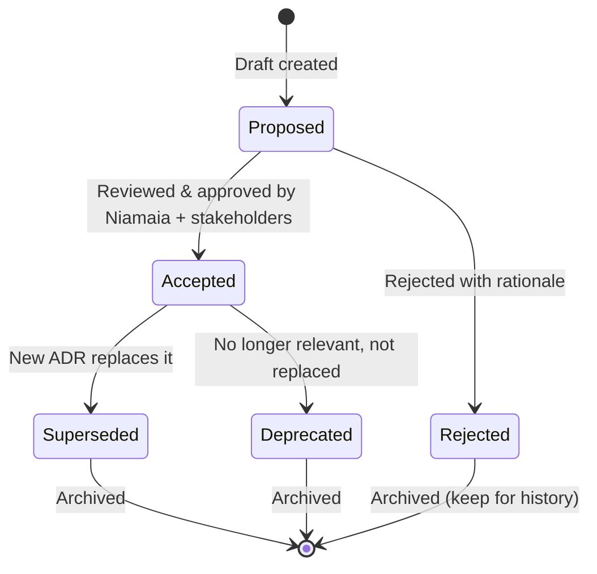

{reasoning effort: high}

# ADR Template - Architecture Decision Records Skill

## Purpose
Standardizes Architecture Decision Records (ADRs) using Michael Nygard's format. Mandatory for all irreversible decisions. Includes index management, quarterly review process, and superseding protocol.

## When to Invoke
- Making irreversible architectural decisions (used by `niamaia`, `trevor`, `security-lead`, `archaeologist`)
- Documenting technology choices
- Recording pattern adoption
- Quarterly ADR review

---

## ADR Format (MANDATORY)

```markdown
# ADR-XXX: [Short Descriptive Title]

## Status: Proposed | Accepted | Superseded | Deprecated

## Date: YYYY-MM-DD

## Context
[Real problem statement, technical/organizational constraints, assumptions, non-functional requirements]
[Link to discussion, issue, PR, relevant docs]

## Decision
[What we decided - concrete action, not vague intention]

## Consequences

### Positive
- [Measurable benefit 1]
- [Measurable benefit 2]

### Negative
- [Cost/trade-off 1]
- [Cost/trade-off 2]

### Risks
- [Risk 1] - [Mitigation]
- [Risk 2] - [Mitigation]

## Alternatives Considered
- [Alternative 1] - [Why rejected: technical/business criterion]
- [Alternative 2] - [Why rejected: technical/business criterion]

## Implementation Notes
- [Guidance for implementation team]
- [POC needed?]
- [Migration path if applicable]

## References
- [Links, docs, discussions, benchmarks, POC results]

## Supersedes
[ADR-XXX if this replaces a previous decision]

## Superseded By
[ADR-XXX if this decision is later replaced]
```

---

## ADR Index (docs/adr/README.md)

```markdown
# Architecture Decision Records Index

| ID | Title | Status | Date | Author | Supersedes | Tags |
|----|-------|--------|------|--------|------------|------|
| ADR-001 | Use PostgreSQL as Primary Database | Accepted | 2024-01-15 | Niamaia | - | database, postgres |
| ADR-002 | Adopt tRPC for Internal APIs | Accepted | 2024-01-20 | Towards | - | api, trpc, typescript |
| ADR-003 | Event-Driven Architecture with Kafka | Accepted | 2024-02-01 | Niamaia | - | events, kafka, async |
| ADR-004 | Multi-Tenant Row Level Security | Accepted | 2024-02-10 | Towards | - | security, multi-tenant, rls |
| ADR-005 | GitOps with ArgoCD | Accepted | 2024-02-15 | Trevor | - | deployment, gitops, argocd |
| ADR-006 | Semgrep for SAST | Accepted | 2024-03-01 | Kaspersky | - | security, sast, semgrep |
| ADR-007 | Strangler Fig for Monolith Migration | Accepted | 2024-03-15 | Archaeologist | - | migration, legacy, strangler-fig |
| ADR-008 | ClickHouse for Analytics | Accepted | 2024-04-01 | Data-Engineer | - | analytics, clickhouse, olap |
| ADR-009 | React Server Components for Web | Proposed | 2024-04-10 | Turing | - | frontend, rsc, nextjs |
| ADR-010 | Replace Jest with Vitest | Accepted | 2024-04-15 | Qualy | - | testing, vitest, jest |

## By Status
### Accepted (Active)
ADR-001, ADR-002, ADR-003, ADR-004, ADR-005, ADR-006, ADR-007, ADR-008, ADR-010

### Proposed (Under Review)
ADR-009

### Superseded
- ADR-000 (Example) → Superseded by ADR-001

### Deprecated
- None

## By Tag
- **database**: ADR-001, ADR-008
- **api**: ADR-002
- **events**: ADR-003
- **security**: ADR-004, ADR-006
- **deployment**: ADR-005
- **migration**: ADR-007
- **testing**: ADR-010
- **frontend**: ADR-009
```

---

## When ADR is REQUIRED

| Decision Category | Examples | ADR Required? |
|-------------------|----------|---------------|
| **Database** | Primary DB choice, sharding strategy, migration strategy | ✅ YES |
| **API Style** | REST vs GraphQL vs gRPC vs tRPC, versioning strategy | ✅ YES |
| **Auth Strategy** | JWT vs Session, OAuth2/OIDC provider, MFA | ✅ YES |
| **Event Broker** | Kafka vs Redis Streams vs NATS, schema registry | ✅ YES |
| **Cache Strategy** | Redis vs In-memory, invalidation, TTL policies | ✅ YES |
| **Deployment** | Kubernetes vs Serverless, GitOps tool, environment strategy | ✅ YES |
| **Observability Stack** | Prometheus vs Datadog, logging, tracing, profiling | ✅ YES |
| **Security Tools** | SAST/DAST/SCA selection, secret management | ✅ YES |
| **Frontend Framework** | Next.js vs Remix vs Vite, RSC adoption | ✅ YES |
| **Testing Strategy** | Tool selection, pyramid shape, contract testing | ✅ YES |
| **Language/Framework** | New language adoption, major version upgrade | ✅ YES |
| **Data Architecture** | CQRS, Event Sourcing, CDC, Lakehouse | ✅ YES |

**If in doubt → Write ADR. Decision not documented = decision not taken.**

---

## ADR Lifecycle



### Review Process
1. **Author** creates ADR in `Proposed` status
2. **Stakeholders** (affected teams) review for 5 business days
3. **Niamaia** facilitates discussion, resolves conflicts
4. **Decision**: Accept / Reject / Request Changes
5. **If Accepted**: Status → `Accepted`, added to index, announced
6. **Quarterly Review**: All `Accepted` ADRs reviewed for relevance

---

## Quarterly Review (Automated Reminder)

```yaml
# .github/workflows/adr-review.yml
name: ADR Quarterly Review
on:
  schedule:
    - cron: '0 9 1 JAN,APR,JUL,OCT *'  # First day of quarter
jobs:
  review:
    runs-on: ubuntu-latest
    steps:
      - uses: actions/checkout@v4
      - name: Find ADRs needing review
        run: |
          # ADRs older than 6 months without review
          find docs/adr -name "ADR-*.md" -mtime +180 | while read f; do
            if ! grep -q "Last Reviewed:" "$f"; then
              echo "::warning file=$f::ADR needs quarterly review"
            fi
          done
      - name: Create Review Issue
        uses: actions/github-script@v7
        with:
          script: |
            const fs = require('fs');
            const adrs = fs.readdirSync('docs/adr').filter(f => f.match(/ADR-\d+\.md/));
            for (const adr of adrs) {
              const content = fs.readFileSync(`docs/adr/${adr}`, 'utf-8');
              if (!content.includes('Last Reviewed:')) {
                await github.rest.issues.create({
                  owner: context.repo.owner,
                  repo: context.repo.repo,
                  title: `[ADR Review] ${adr}: Quarterly review needed`,
                  body: `ADR ${adr} has not been reviewed in 6+ months. Please review and add "Last Reviewed: YYYY-MM-DD" header.`,
                  labels: ['adr', 'review', 'quarterly']
                });
              }
            }
```

---

## ADR Template (Copy-Paste Ready)

```markdown
# ADR-XXX: [Title]

## Status: Proposed

## Date: YYYY-MM-DD

## Authors: [@github-handles]

## Context
**Problem**: [What problem are we solving?]
**Constraints**: [Technical, organizational, budget, timeline]
**Assumptions**: [What are we assuming?]
**Requirements**: [Functional + Non-functional (latency, scale, cost, compliance)]

## Decision
**We will**: [Concrete action]
**Because**: [Primary rationale]

## Consequences

### Positive
- [Benefit 1 with metric if possible]
- [Benefit 2 with metric if possible]

### Negative
- [Cost 1 with estimate]
- [Cost 2 with estimate]

### Risks
| Risk | Likelihood | Impact | Mitigation |
|------|------------|--------|------------|
| [Risk 1] | [High/Med/Low] | [High/Med/Low] | [Specific mitigation] |
| [Risk 2] | [High/Med/Low] | [High/Med/Low] | [Specific mitigation] |

## Alternatives Considered
| Alternative | Pros | Cons | Why Rejected |
|-------------|------|------|--------------|
| [Alt 1] | [Pros] | [Cons] | [Criterion] |
| [Alt 2] | [Pros] | [Cons] | [Criterion] |

## Implementation Plan
- [ ] [Task 1] - [Owner] - [Timeline]
- [ ] [Task 2] - [Owner] - [Timeline]
- [ ] [POC/Spike] - [Owner] - [Timeline] (if needed)

## Migration Path (if replacing existing)
1. [Phase 1: Parallel run / Shadow traffic]
2. [Phase 2: Canary / Feature flag]
3. [Phase 3: Full cutover]
4. [Rollback trigger: specific metric threshold]

## Follow-up
- **Review Date**: YYYY-MM-DD (6 months from acceptance)
- **Metrics to Watch**: [Specific metrics with thresholds]
- **Success Criteria**: [How we know this worked]

## References
- [Link 1]
- [Link 2]
```

---

## ADR Quality Checklist

Before marking `Accepted`:
- [ ] **Context** describes real problem (not solution in search of problem)
- [ ] **Decision** is actionable (not "we should consider")
- [ ] **Consequences** include both positive AND negative
- [ ] **Risks** have specific mitigations (not "monitor")
- [ ] **Alternatives** are real options that were seriously considered
- [ ] **Implementation Plan** has owners and timelines
- [ ] **Migration Path** exists if replacing something
- [ ] **Review Date** set (6 months)
- [ ] **Metrics** defined for success evaluation
- [ ] **Stakeholders** have reviewed (evidence: comments/approvals)
- [ ] **Index** updated with new ADR

---

## Superseding Protocol

When a new decision replaces an old one:

1. **Create new ADR** with `Status: Accepted`
2. **Add `Supersedes: ADR-XXX`** to new ADR
3. **Update old ADR**: Change status to `Superseded`, add `Superseded By: ADR-YYY`
4. **Update Index**: Move old ADR to Superseded section
5. **Announce**: Notify stakeholders of change

```markdown
# ADR-015: Migrate from Kafka to Redpanda

## Status: Accepted

## Supersedes: ADR-003 (Event-Driven Architecture with Kafka)

## Context
...

# ADR-003: Event-Driven Architecture with Kafka

## Status: Superseded

## Superseded By: ADR-015 (Migrate from Kafka to Redpanda)
```

---

## Output Format (for agent using this skill)
```
## ADR Created/Updated
- ADR ID: [ADR-XXX]
- Title: [Title]
- Status: [Proposed/Accepted/Superseded/Deprecated]
- Supersedes: [ADR-XXX if applicable]
- Key Decision: [One sentence]
- Review Date: [YYYY-MM-DD]
- Index Updated: [Yes/No]
```