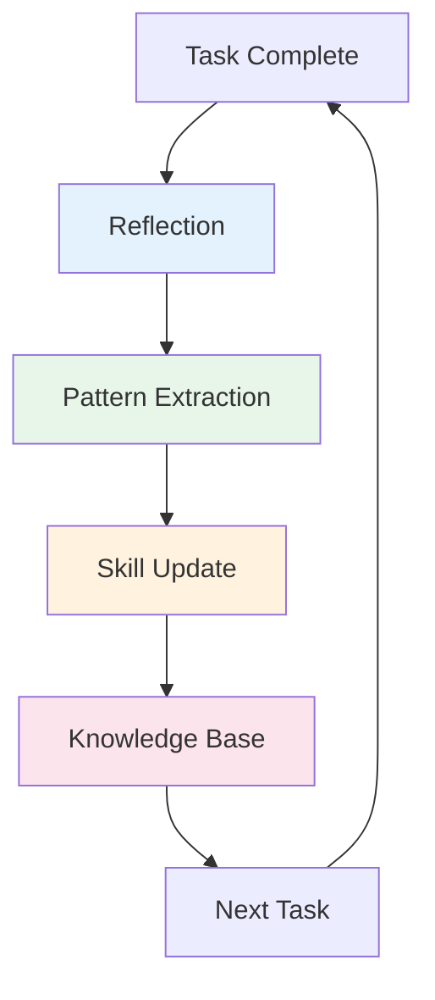

{reasoning effort: high}

# Continuous Learning v2 - Organizational Learning Skill

## Purpose
Captures instincts, evolves skills, and learns from every completed task. Implements post-task reflection, pattern extraction, and automated skill updates to continuously improve the agent team.

## When to Invoke
- After completing features/fixes (used by `severino`, all agents)
- Sprint retrospectives
- Incident postmortems
- Skill quality audits
- Onboarding new agents

---

## Learning Loop



---

## Phase 1: Structured Reflection

### Reflection Template (Per Task)

```markdown
# Learning Reflection: [Task Name]

## Task Summary
- **Type**: [Feature/Bugfix/Refactor/Research/Spike]
- **Size**: [Trivial/Small/Standard/Large]
- **Duration**: [Actual hours vs estimated]
- **Agents Involved**: [List]

## What Went Well
| Aspect | Detail | Why It Worked |
|--------|--------|---------------|

## What Was Difficult
| Challenge | Root Cause | Time Lost | Resolution |
|-----------|------------|-----------|------------|

## Decisions Made
| Decision | Options Considered | Chosen | Rationale | Regret? |
|----------|-------------------|--------|-----------|---------|

## Surprises
| Expected | Actual | Learning |
|----------|--------|----------|

## Process Observations
| Process Step | Worked? | Friction | Improvement Idea |
|--------------|---------|----------|------------------|

## Tool/Skill Gaps
| Missing Capability | Workaround Used | Skill to Create/Update |
|-------------------|-----------------|------------------------|

## Knowledge to Preserve
| Insight | Applicable To | Format (ADR/Skill/Doc/Comment) |
|---------|---------------|-------------------------------|

## Metrics
- Lead time: [Actual vs target]
- Verification loops: [Count]
- Review iterations: [Count]
- Bugs found post-merge: [Count]
- Context switches: [Count]
```

### Reflection Triggers
- **Automatic**: After every merged PR (via git hook/CI)
- **Manual**: Complex tasks, incidents, retrospectives
- **Scheduled**: Weekly learning review (Severino)

---

## Phase 2: Pattern Extraction

### Pattern Types

```typescript
enum PatternType {
  ARCHITECTURAL = 'architectural',      // Reusable architecture decisions
  IMPLEMENTATION = 'implementation',    // Code patterns, idioms
  PROCESS = 'process',                  // Workflow improvements
  DEBUGGING = 'debugging',              // Debugging techniques
  TESTING = 'testing',                  // Test patterns
  SECURITY = 'security',                // Security patterns
  PERFORMANCE = 'performance',          // Optimization patterns
  COMMUNICATION = 'communication',      // Team/agent coordination
}

interface ExtractedPattern {
  id: string;
  type: PatternType;
  name: string;
  description: string;
  context: string;           // When to apply
  example: string;           // Code/config snippet
  antiPattern?: string;      // What to avoid
  confidence: number;        // 0-1 based on occurrences
  sourceTasks: string[];     // Task IDs that generated this
  createdAt: Date;
  updatedAt: Date;
  applications: number;      // Times successfully applied
}
```

### Extraction Algorithm

```typescript
class PatternExtractor {
  async extractFromReflections(reflections: Reflection[]): Promise<ExtractedPattern[]> {
    const patterns: Map<string, ExtractedPattern> = new Map();
    
    for (const reflection of reflections) {
      // 1. Extract from "What Went Well"
      for (const item of reflection.wentWell) {
        const pattern = this.candidateFromSuccess(item, reflection);
        this.mergeOrCreate(patterns, pattern);
      }
      
      // 2. Extract from "What Was Difficult" (inverse patterns)
      for (const item of reflection.difficult) {
        const pattern = this.candidateFromFailure(item, reflection);
        this.mergeOrCreate(patterns, pattern);
      }
      
      // 3. Extract from "Decisions Made"
      for (const decision of reflection.decisions) {
        if (!decision.regret) {
          const pattern = this.candidateFromDecision(decision, reflection);
          this.mergeOrCreate(patterns, pattern);
        }
      }
      
      // 4. Extract from "Tool/Skill Gaps"
      for (const gap of reflection.skillGaps) {
        const pattern = this.candidateFromGap(gap, reflection);
        this.mergeOrCreate(patterns, pattern);
      }
    }
    
    // Filter: confidence > 0.6, applications > 1
    return Array.from(patterns.values())
      .filter(p => p.confidence > 0.6 && p.applications > 1)
      .sort((a, b) => b.confidence - a.confidence);
  }
  
  private candidateFromSuccess(item: SuccessItem, reflection: Reflection): Partial<ExtractedPattern> {
    return {
      type: this.inferType(item.aspect),
      name: this.generateName(item.detail),
      description: item.detail,
      context: reflection.taskSummary,
      example: item.detail,
      confidence: 0.7,
      sourceTasks: [reflection.taskId],
      applications: 1,
    };
  }
  
  private candidateFromFailure(item: DifficultItem, reflection: Reflection): Partial<ExtractedPattern> {
    return {
      type: this.inferType(item.challenge),
      name: `Avoid: ${this.generateName(item.challenge)}`,
      description: `Anti-pattern: ${item.challenge}. Root cause: ${item.rootCause}. Resolution: ${item.resolution}`,
      context: reflection.taskSummary,
      example: item.resolution,
      antiPattern: item.challenge,
      confidence: 0.8,  // Failures are high-signal
      sourceTasks: [reflection.taskId],
      applications: 1,
    };
  }
}
```

---

## Phase 3: Skill Evolution

### Skill Update Process

```markdown
## Skill Update Workflow

### 1. Pattern → Skill Mapping
| Pattern | Target Skill | Update Type |
|---------|--------------|-------------|
| "Always use Result types for errors" | clean-code-patterns | Add rule |
| "Strangler Fig for migrations" | migration-patterns | Add example |
| "Tenant scoping in all queries" | backend-code-review | Add check |
| "Manual QA evidence required" | work-with-pr | Reinforce |

### 2. Skill Update Types
- **Add Rule**: New checklist item, lint rule, pattern
- **Add Example**: Code snippet in references/
- **Clarify Boundary**: When pattern applies/doesn't
- **Deprecate**: Replace with better pattern
- **Split Skill**: If skill too broad
- **Merge Skills**: If overlapping

### 3. Update Process
1. Create skill update proposal (PR to skills repo)
2. `skill-stocktake` agent reviews for quality
3. `skill-comply` agent checks consistency
4. Approve → merge → version bump
5. Notify all agents (hot-reload or next session)
```

### Skill Versioning
```yaml
# Skill version in frontmatter
version: "2.3.0"
changelog:
  - "2.3.0: Added tenant scoping rule (from ORD-1234, PAY-567)"
  - "2.2.0: Clarified Result type boundaries"
  - "2.1.0: Added Strangler Fig migration example"
```

---

## Phase 4: Knowledge Base

### Learning Database Schema

```sql
-- reflections table
CREATE TABLE reflections (
  id UUID PRIMARY KEY,
  task_id VARCHAR(255),
  task_type VARCHAR(50),
  size_classification VARCHAR(20),
  duration_hours DECIMAL(5,2),
  estimated_hours DECIMAL(5,2),
  agents JSONB,
  reflection_json JSONB,
  created_at TIMESTAMP DEFAULT NOW()
);

-- patterns table
CREATE TABLE patterns (
  id UUID PRIMARY KEY,
  type VARCHAR(50),
  name VARCHAR(255),
  description TEXT,
  context TEXT,
  example TEXT,
  anti_pattern TEXT,
  confidence DECIMAL(3,2),
  source_tasks UUID[],
  applications INTEGER DEFAULT 0,
  created_at TIMESTAMP DEFAULT NOW(),
  updated_at TIMESTAMP DEFAULT NOW()
);

-- pattern_applications table
CREATE TABLE pattern_applications (
  id UUID PRIMARY KEY,
  pattern_id UUID REFERENCES patterns(id),
  task_id VARCHAR(255),
  success BOOLEAN,
  notes TEXT,
  applied_at TIMESTAMP DEFAULT NOW()
);

-- skill_versions table
CREATE TABLE skill_versions (
  skill_name VARCHAR(255) PRIMARY KEY,
  version VARCHAR(50),
  changelog JSONB,
  updated_at TIMESTAMP DEFAULT NOW()
);
```

---

## Automated Learning (CI/CD)

```yaml
# .github/workflows/continuous-learning.yml
name: Continuous Learning
on:
  push:
    branches: [main]
  workflow_dispatch:
  schedule:
    - cron: '0 9 * * 1'  # Weekly Monday

jobs:
  extract-patterns:
    name: Extract Patterns
    runs-on: ubuntu-latest
    steps:
      - uses: actions/checkout@v4
      
      - name: Fetch Recent Reflections
        run: |
          # Query reflections from last week
          gh api /repos/{owner}/{repo}/issues \
            --jq '.[] | select(.labels[].name=="reflection" and .created_at > "'$(date -d '7 days ago' -Iseconds)'")' \
            > recent-reflections.json
      
      - name: Run Pattern Extraction
        run: |
          python scripts/extract_patterns.py \
            --input recent-reflections.json \
            --output extracted-patterns.json \
            --min-confidence 0.6 \
            --min-applications 2
      
      - name: Create Skill Update Proposals
        run: |
          python scripts/propose_skill_updates.py \
            --patterns extracted-patterns.json \
            --skills-dir ./ResultadoFinal/skills \
            --output-dir ./skill-proposals
      
      - name: Open PRs for Skill Updates
        run: |
          for proposal in ./skill-proposals/*.md; do
            gh pr create \
              --title "Skill Update: $(basename $proposal .md)" \
              --body-file "$proposal" \
              --label "skill-update,automated" \
              --base main
          done

  weekly-review:
    name: Weekly Learning Review
    runs-on: ubuntu-latest
    if: github.event_name == 'schedule'
    steps:
      - uses: actions/checkout@v4
      - name: Generate Weekly Learning Report
        run: |
          python scripts/weekly_report.py \
            --since "$(date -d '7 days ago' -Iseconds)" \
            --output weekly-learning-report.md
      - name: Post to Slack
        run: |
          curl -X POST $SLACK_WEBHOOK \
            -H 'Content-Type: application/json' \
            -d "{\"text\":\"📚 Weekly Learning Report\",\"blocks\":$(cat weekly-learning-report.md | jq -Rs .)}"
```

---

## Learning Metrics Dashboard

```json
{
  "dashboard": {
    "title": "Continuous Learning Metrics",
    "panels": [
      {
        "title": "Patterns Extracted (30d)",
        "type": "stat",
        "targets": [{ "expr": "count(patterns_extracted_total{window=\"30d\"})" }]
      },
      {
        "title": "Skill Updates (30d)",
        "type": "stat",
        "targets": [{ "expr": "count(skill_updates_total{window=\"30d\"})" }]
      },
      {
        "title": "Pattern Application Success Rate",
        "type": "graph",
        "targets": [
          { "expr": "rate(pattern_applications_success_total[7d]) / rate(pattern_applications_total[7d])" }
        ]
      },
      {
        "title": "Top Patterns by Confidence",
        "type": "table",
        "targets": [{ "expr": "topk(10, patterns_by_confidence)", "format": "table" }]
      },
      {
        "title": "Reflection Completion Rate",
        "type": "graph",
        "targets": [
          { "expr": "rate(reflections_completed_total[7d]) / rate(tasks_completed_total[7d])" }
        ]
      },
      {
        "title": "Average Lead Time vs Estimation Accuracy",
        "type": "graph",
        "targets": [
          { "expr": "avg(task_actual_hours / task_estimated_hours)" }
        ]
      }
    ]
  }
}
```

---

## Agent-Specific Learning

### Per-Agent Learning Profile

```typescript
interface AgentLearningProfile {
  agent: string;
  strengths: string[];           // Patterns this agent excels at
  weaknesses: string[];          // Patterns this agent struggles with
  preferredPatterns: string[];   // Patterns this agent uses most
  avoidedPatterns: string[];     // Patterns this agent avoids
  skillGaps: string[];           // Skills this agent needs
  learningVelocity: number;      // Patterns learned per month
  lastUpdated: Date;
}

// Updated after each task
function updateAgentProfile(agent: string, taskResult: TaskResult): void {
  const profile = loadProfile(agent);
  
  // Track pattern usage
  for (const pattern of taskResult.patternsUsed) {
    profile.preferredPatterns = incrementCount(profile.preferredPatterns, pattern);
  }
  
  // Track struggles
  for (const difficulty of taskResult.reflection.difficult) {
    profile.weaknesses = incrementCount(profile.weaknesses, difficulty.rootCause);
  }
  
  // Track successes
  for (const success of taskResult.reflection.wentWell) {
    profile.strengths = incrementCount(profile.strengths, success.aspect);
  }
  
  saveProfile(profile);
}
```

---

## Output Format (for agent using this skill)
```
## Continuous Learning Capture
- Task: [Name]
- Reflection: [Completed - stored]
- Patterns Extracted: [Count] - [top 3]
- Skill Updates Proposed: [Count] - [skills]
- Agent Profile Updates: [Agents]
- Metrics: [Lead time accuracy, verification loops, review iterations]
- Next Application: [Where patterns apply next]
```