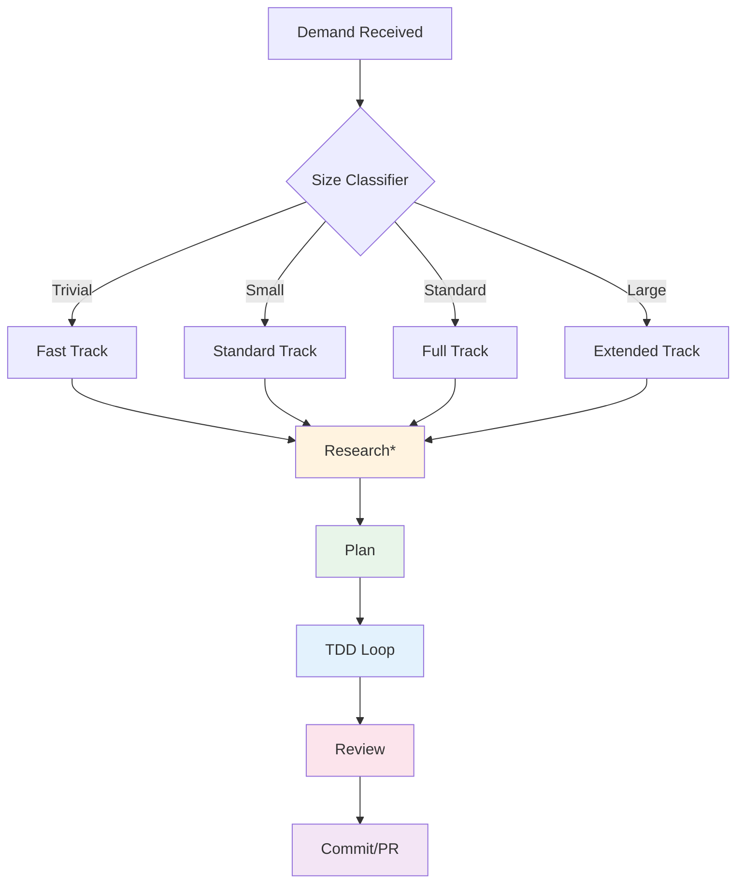

{reasoning effort: high}

# Orch Pipeline - Gated Feature Workflow Engine Skill

## Purpose
Defines the Orch Pipeline: a gated workflow engine that drives all feature/fix/refactor/MVP work through Research → Plan → TDD → Review → Commit phases. Size classifier (trivial/small/standard/large) determines depth and required gates.

## When to Invoke
- Starting ANY new feature/fix/refactor/MVP (used by `severino`, `pr-engineer`, `towards`, `turing`)
- Work decomposition and planning
- Ensuring process compliance
- Quality gate enforcement

---

## Pipeline Overview



---

## Size Classifier

```typescript
type WorkSize = 'trivial' | 'small' | 'standard' | 'large';

interface SizeClassification {
  size: WorkSize;
  estimatedHours: number;
  maxFiles: number;
  requiresADR: boolean;
  requiresThreatModel: boolean;
  requiresDesignDoc: boolean;
  parallelTracks: number;
  reviewDepth: 'light' | 'standard' | 'deep' | 'architectural';
}

function classifyWork(task: Task): SizeClassification {
  const factors = {
    filesEstimated: estimateFiles(task),
    hoursEstimated: estimateHours(task),
    isNewFeature: task.type === 'feature',
    isRefactor: task.type === 'refactor',
    touchesAuth: task.tags.includes('auth'),
    touchesPayments: task.tags.includes('payments'),
    touchesPII: task.tags.includes('pii'),
    touchesInfra: task.tags.includes('infra'),
    crossModule: task.modules.length > 1,
    breakingChanges: task.breakingChanges || false,
  };
  
  // Trivial: typo, config, 1-2 lines, < 30 min
  if (factors.hoursEstimated <= 0.5 && factors.filesEstimated <= 2 && !factors.crossModule) {
    return {
      size: 'trivial',
      estimatedHours: factors.hoursEstimated,
      maxFiles: 2,
      requiresADR: false,
      requiresThreatModel: false,
      requiresDesignDoc: false,
      parallelTracks: 1,
      reviewDepth: 'light',
    };
  }
  
  // Small: bug fix, minor enhancement, 1-4 hours, 3-10 files
  if (factors.hoursEstimated <= 4 && factors.filesEstimated <= 10) {
    return {
      size: 'small',
      estimatedHours: factors.hoursEstimated,
      maxFiles: 10,
      requiresADR: false,
      requiresThreatModel: factors.touchesAuth || factors.touchesPayments || factors.touchesPII,
      requiresDesignDoc: false,
      parallelTracks: 1,
      reviewDepth: 'standard',
    };
  }
  
  // Large: new system, major refactor, architectural change, > 2 days, cross-module
  if (factors.hoursEstimated > 16 || factors.filesEstimated > 30 || 
      factors.breakingChanges || factors.touchesInfra) {
    return {
      size: 'large',
      estimatedHours: factors.hoursEstimated,
      maxFiles: 100,
      requiresADR: true,
      requiresThreatModel: true,
      requiresDesignDoc: true,
      parallelTracks: Math.min(5, factors.modules.length),
      reviewDepth: 'architectural',
    };
  }
  
  // Standard: everything else
  return {
    size: 'standard',
    estimatedHours: factors.hoursEstimated,
    maxFiles: 30,
    requiresADR: factors.crossModule || factors.breakingChanges,
    requiresThreatModel: factors.touchesAuth || factors.touchesPayments || factors.touchesPII,
    requiresDesignDoc: factors.crossModule,
    parallelTracks: Math.min(3, factors.modules.length),
    reviewDepth: 'deep',
  };
}
```

---

## Phase 1: Research (Gated Entry)

### Purpose
Understand the problem space, existing code, constraints, and prior art before planning.

### Required for: ALL sizes (depth varies)

```markdown
## Research Checklist

### Codebase Exploration
- [ ] Find related files (grep, LSP, dependency graph)
- [ ] Understand existing patterns in this area
- [ ] Identify similar features/fixes (git log, PRs)
- [ ] Check for existing tests to extend
- [ ] Locate relevant ADRs and design docs

### Constraints & Dependencies
- [ ] Technical constraints (API contracts, DB schema, infra)
- [ ] Organizational constraints (team ownership, release schedule)
- [ ] Dependency mapping (what blocks what)
- [ ] Risk identification (security, performance, data migration)

### Prior Art
- [ ] Internal: Similar implementations in codebase
- [ ] External: Libraries, patterns, industry solutions
- [ ] Decision log: Why previous choices were made

### Research Output (Artifact)
```markdown
# Research: [Task Name]

## Problem Statement
[Clear, concise problem description]

## Current State
[How it works today, with file references]

## Constraints
- Technical: [list]
- Organizational: [list]
- Dependencies: [list]

## Options Explored
| Option | Pros | Cons | Effort |
|--------|------|------|--------|

## Recommendation
[Preferred approach with rationale]

## Risks
| Risk | Likelihood | Impact | Mitigation |
|------|------------|--------|------------|

## Open Questions
[Questions for Severino/stakeholders]
```

### Gate: Research Complete
- [ ] Research artifact written
- [ ] Open questions resolved or escalated
- [ ] Severino approves proceeding to Plan

---

## Phase 2: Plan (Gated)

### Purpose
Create detailed, atomic execution plan with success criteria for TDD.

### Required for: small, standard, large (trivial skips to TDD)

```markdown
## Plan: [Task Name]

### Size Classification
- Size: [trivial/small/standard/large]
- Estimated Hours: [X]
- Parallel Tracks: [N]

### Decomposition (Atomic PRs)
| PR # | Title | Scope | Depends On | Est. Hours | Owner |
|------|-------|-------|------------|------------|-------|
| 1 | [Title] | [Files, scope] | - | [X] | [Agent] |
| 2 | [Title] | [Files, scope] | PR 1 | [X] | [Agent] |

### Success Criteria (Per PR)
| PR | Criterion | Test Type | Manual QA Steps |
|----|-----------|-----------|-----------------|
| 1 | [Specific behavior] | Unit + Integration | [Steps] |
| 1 | [Error handling] | Unit | [Steps] |
| 2 | [Integration] | Contract + E2E | [Steps] |

### Technical Approach
- [ ] Architecture decisions (ADR refs)
- [ ] Data model changes (migration plan)
- [ ] API contracts (OpenAPI/tRPC)
- [ ] Feature flags (rollout plan)
- [ ] Rollback plan

### Security & Compliance
- [ ] Threat model required: [Yes/No] → [Link if done]
- [ ] PII handling: [Details]
- [ ] Audit logging: [Requirements]

### Review Requirements
- [ ] `tranquilao` review (always)
- [ ] `niamaia` review (if ADR/threat model)
- [ ] `kaspersky` review (if security-sensitive)
- [ ] `trevor` review (if infra changes)
- [ ] `qualy` review (test strategy)

### Gate: Plan Approved
- [ ] Plan artifact written
- [ ] All success criteria defined
- [ ] Dependencies resolved
- [ ] Severino approves proceeding to TDD
```

---

## Phase 3: TDD Loop (Core Execution)

### Purpose
Implement via Test-Driven Development with evidence-bound manual QA.

### Process (Per Atomic PR)
```markdown
## TDD Cycle (Repeat per Success Criterion)

### 1. Write Failing Test (Red)
- Unit test for business logic
- Integration test for contracts/DB
- Contract test for API boundaries
- E2E test for critical journeys (if applicable)

### 2. Implement (Green)
- Minimal code to pass test
- Follow clean code patterns
- TypeScript strict, no any

### 3. Refactor (Green)
- Improve design without changing behavior
- Run tests after each refactor step

### 4. Manual QA (MANDATORY)
- Drive real harness (tmux, curl, browser, CLI)
- Observe expected behavior
- Write evidence: `.omo/evidence/YYYYMMDD-slug/qa-evidence.json`

### 5. Commit (Atomic)
- Pair implementation with tests
- Conventional commit message
- Reference success criterion

### 6. Verify Loop (Local)
- Typecheck, lint, test, build
- Security scan
- Architecture check
```

### TDD Rules
- **No implementation without failing test first**
- **No commit without manual QA evidence**
- **No refactoring without tests passing**
- **One criterion = one commit (minimum)**
- **Commit message references criterion ID**

---

## Phase 4: Review (Gated)

### Purpose
Multi-layer review before commit/PR.

### Review Layers

| Layer | Reviewer | Focus | Required For |
|-------|----------|-------|--------------|
| **Self** | Author | Verification loop (7 gates) | ALL |
| **Peer** | `tranquilao` | Code quality, security, patterns | ALL |
| **Architect** | `niamaia` | Architecture compliance, ADR alignment | If ADR required |
| **Security** | `kaspersky` | Threat model, vulnerabilities | If threat model required |
| **Infra** | `trevor` | Deploy, scaling, observability | If infra changes |
| **Quality** | `qualy` | Test strategy, coverage, flakiness | Standard+ |
| **Performance** | `performance-engineer` | Benchmarks, profiling | Large/perf-critical |

### Review Process
```markdown
## Review Checklist

### tranquilao (Mandatory)
- [ ] TypeScript strict (zero any)
- [ ] Lint clean
- [ ] Tests meaningful (not implementation details)
- [ ] Security: no SQL concat, no XSS, authZ checked
- [ ] Performance: no N+1, no obvious bottlenecks
- [ ] Patterns: follows codebase conventions
- [ ] Naming: clear, consistent
- [ ] Error handling: Result types, no silent failures
- [ ] Documentation: "why" comments for non-obvious

### niamaia (If Required)
- [ ] Architecture boundaries respected
- [ ] ADR followed or new ADR created
- [ ] Data flow correct
- [ ] Scalability considered

### kaspersky (If Required)
- [ ] Threat model mitigations implemented
- [ ] No new vulnerabilities
- [ ] Secrets handled correctly
- [ ] Compliance: LGPD/SOC2/PCI

### Gate: Review Passed
- [ ] All required reviewers approved
- [ ] No blocking issues
- [ ] Author addressed all required changes
```

---

## Phase 5: Commit / PR (Gated Exit)

### Purpose
Create PR, run verification loop, merge, cleanup.

### PR Creation
```markdown
## PR Requirements

### Atomicity
- Single logical change
- Compiles, passes, stands alone
- < 400 lines (split if larger)

### PR Body
- What Changed (user impact)
- Why (problem, context, ADR links)
- How Tested (manual QA evidence path)
- Residual Risk
- Checklist complete

### Verification Loop (MANDATORY)
Run all 7 gates:
1. Build
2. Type Check
3. Lint
4. Tests + Coverage
5. Security
6. Architecture
7. Diff Review

### Cubic Review
- Wait for cubic-dev-ai[bot]
- "No issues found" = pass
- Issues = fix → re-QA → loop
- Quota exhausted = only valid skip

### Merge
- Merge commit ONLY (no squash)
- Auto-merge enabled
- Wait for actual merge
- Worktree cleanup
```

---

## Pipeline Execution (Severino Orchestrates)

```typescript
// Severino's orchestration logic
async function executeOrchPipeline(task: Task): Promise<Result> {
  // 1. Classify
  const classification = classifyWork(task);
  
  // 2. Research (always)
  const research = await delegateResearch(task, classification);
  if (!research.approved) return { blocked: 'research' };
  
  // 3. Plan (if not trivial)
  let plan;
  if (classification.size !== 'trivial') {
    plan = await delegatePlan(task, research, classification);
    if (!plan.approved) return { blocked: 'plan' };
  }
  
  // 4. Execute TDD (parallel tracks)
  const prResults = await executeParallelTDD(plan, classification);
  
  // 5. Review & Verify (per PR)
  for (const pr of prResults) {
    const review = await delegateReview(pr, classification);
    if (!review.passed) return { blocked: 'review', pr };
    
    const verification = await runVerificationLoop(pr);
    if (!verification.passed) return { blocked: 'verification', pr };
  }
  
  // 6. Merge all
  await mergeAllPRs(prResults);
  
  // 6. Learning Capture
  await invokeContinuousLearning(task, prResults);
  
  return { success: true, prs: prResults };
}
```

---

## Pipeline Metrics

| Metric | Target | Measurement |
|--------|--------|-------------|
| **Lead Time** | < 2 days (demand → prod) | Timestamp tracking |
| **Classification Accuracy** | > 90% | Actual vs estimated hours |
| **Research Gate Pass** | 100% | No skipped research |
| **Plan Gate Pass** | 100% | No skipped plan for standard+ |
| **TDD Compliance** | 100% | Test-first commits |
| **QA Evidence** | 100% | Evidence file per criterion |
| **Review Gate Pass** | > 95% first pass | Review iterations |
| **Verification First-Pass** | > 80% | CI pass rate |
| **Rework Rate** | < 10% | Commits after review start |
| **Cycle Time per PR** | < 4 hours | PR open → merged |

---

## Output Format (for agent using this skill)
```
## Orch Pipeline Execution
- Task: [Name]
- Classification: [trivial/small/standard/large]
- Research: [Completed - artifact link]
- Plan: [Completed - artifact link / Skipped]
- TDD Tracks: [N parallel]
- PRs Created: [Count] - [links]
- Reviews: [All passed / Blocking issues]
- Verification: [All gates passed]
- Merged: [Yes/No]
- Cycle Time: [Hours]
- Learning Captured: [Yes/No]
```