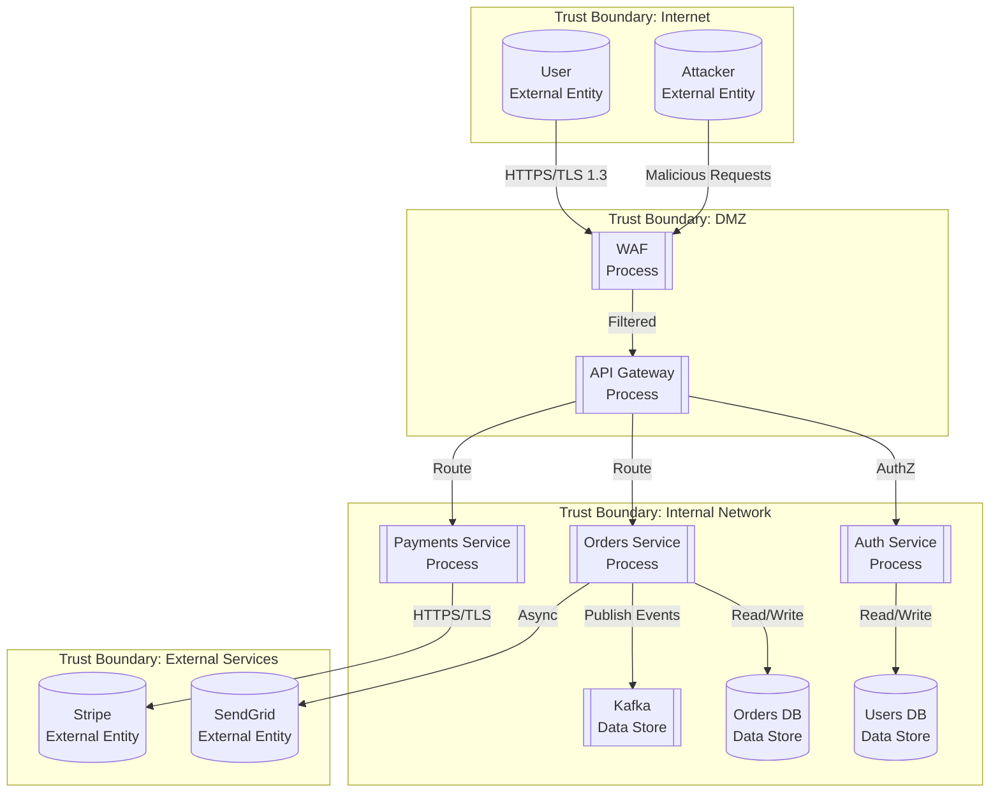
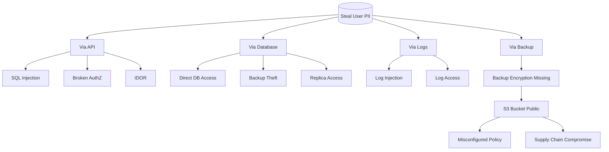

{reasoning effort: high}

# Threat Modeling - STRIDE + DFD Skill

## Purpose
Standardizes threat modeling using STRIDE methodology with Data Flow Diagrams (DFD), attack trees, risk scoring (CVSS 4.0), and mitigation tracking. Mandatory for authentication, payments, PII handling, and new trust boundaries.

## When to Invoke
- New feature development (used by `niamaia`, `kaspersky`, `security-lead`, `tranquilao`)
- Architecture changes affecting trust boundaries
- Security audits
- Compliance preparation (LGPD, SOC2, PCI-DSS)
- Incident response (root cause analysis)

---

## Threat Modeling Process

### Phase 1: Draw Data Flow Diagram (DFD)



**DFD Elements:**
| Symbol | Element | Description |
|--------|---------|-------------|
| `(` `)` | External Entity | Human or system outside control |
| `[` `]` | Process | Code that transforms data |
| `(` `)` | Data Store | Where data rests (DB, queue, file) |
| `→` | Data Flow | Data in motion |
| `━━` | Trust Boundary | Zone with same trust level |

### Phase 2: Enumerate Threats (STRIDE)

| STRIDE | Description | Example in DFD |
|--------|-------------|----------------|
| **S**poofing | Pretending to be something/someone else | Attacker steals JWT, impersonates user |
| **T**ampering | Modifying data | Modify order total in transit |
| **R**epudiation | Denying an action | User claims they didn't place order |
| **I**nformation Disclosure | Exposing data to unauthorized | PII leaked in API response |
| **D**enial of Service | Making service unavailable | Flood API Gateway |
| **E**levation of Privilege | Gaining unauthorized access | Regular user accesses admin endpoint |

#### Threat Enumeration Template

```markdown
## Threat Model: Order Placement Flow

### Trust Boundaries
1. **Internet** (User, Attacker)
2. **DMZ** (WAF, API Gateway)
3. **Internal** (Auth, Orders, Payments, DBs, Kafka)
4. **External Services** (Stripe, SendGrid)

### Threats by Element

#### Process: API Gateway
| ID | STRIDE | Threat | Attack Path | Likelihood | Impact | CVSS 4.0 |
|----|--------|--------|-------------|------------|--------|----------|
| TM-001 | Spoofing | JWT token theft via XSS | Attacker injects script → steals localStorage token → calls API | Medium | High | 7.1 |
| TM-002 | Tampering | Request parameter modification | Attacker intercepts/modifies order total before WAF | Low | Critical | 8.2 |
| TM-003 | Info Disclosure | Error messages leak stack traces | Unhandled exception returns internal details | Medium | Medium | 5.3 |
| TM-004 | DoS | Rate limit bypass | Distributed requests from multiple IPs | High | High | 7.5 |

#### Data Store: Users DB
| ID | STRIDE | Threat | Attack Path | Likelihood | Impact | CVSS 4.0 |
|----|--------|--------|-------------|------------|--------|----------|
| TM-005 | Info Disclosure | SQL injection via user input | Unsantized input in search → UNION SELECT on users table | Low | Critical | 9.1 |
| TM-006 | Elevation | Tenant data access | Missing tenant_id filter → cross-tenant data leak | Medium | Critical | 8.7 |
| TM-007 | Tampering | Direct DB modification | Compromised service account → direct DB write | Low | Critical | 8.9 |

#### Data Flow: Orders → Kafka
| ID | STRIDE | Threat | Attack Path | Likelihood | Impact | CVSS 4.0 |
|----|--------|--------|-------------|------------|--------|----------|
| TM-008 | Tampering | Event modification in transit | MITM on Kafka (no mTLS) → modify order event | Low | High | 7.4 |
| TM-009 | Spoofing | Fake event injection | Attacker produces to topic (weak ACL) | Medium | High | 7.8 |
| TM-010 | Repudiation | No audit trail on consumption | Consumer processes event, no log of who/when | Medium | Medium | 5.9 |
```

### Phase 3: Risk Assessment (CVSS 4.0)

```typescript
// CVSS 4.0 Calculator
interface CVSS4Vector {
  // Base Metrics
  attackVector: 'NETWORK' | 'ADJACENT' | 'LOCAL' | 'PHYSICAL';
  attackComplexity: 'LOW' | 'HIGH';
  attackRequirements: 'NONE' | 'PRESENT';
  privilegesRequired: 'NONE' | 'LOW' | 'HIGH';
  userInteraction: 'NONE' | 'PASSIVE' | 'ACTIVE';
  vulnerableSystemConfidentiality: 'HIGH' | 'LOW' | 'NONE';
  vulnerableSystemIntegrity: 'HIGH' | 'LOW' | 'NONE';
  vulnerableSystemAvailability: 'HIGH' | 'LOW' | 'NONE';
  subsequentSystemConfidentiality: 'HIGH' | 'LOW' | 'NONE';
  subsequentSystemIntegrity: 'HIGH' | 'LOW' | 'NONE';
  subsequentSystemAvailability: 'HIGH' | 'LOW' | 'NONE';
  
  // Threat Metrics (Environmental)
  exploitMaturity: 'NOT_DEFINED' | 'ATTACKED' | 'PROOF_OF_CONCEPT' | 'UNPROVEN';
  // ... environmental metrics
}

function calculateCVSS4(vector: CVSS4Vector): { score: number; severity: 'CRITICAL' | 'HIGH' | 'MEDIUM' | 'LOW' } {
  // Implementation per FIRST.org CVSS 4.0 spec
  // Score 0.0 - 10.0
  // CRITICAL: 9.0-10.0, HIGH: 7.0-8.9, MEDIUM: 4.0-6.9, LOW: 0.1-3.9
}
```

### Phase 4: Mitigations

```markdown
## Mitigations

| Threat ID | Mitigation | Type | Implementation | Verification |
|-----------|------------|------|----------------|--------------|
| TM-001 | HttpOnly, Secure, SameSite=Strict cookies | Preventive | Auth service sets cookies | Code review + DAST |
| TM-001 | CSP header with nonce | Preventive | API Gateway adds CSP | Security headers test |
| TM-001 | Short JWT expiry (15min) + refresh rotation | Detective/Recovery | Auth service implements | Integration test |
| TM-002 | Request signing (HMAC) for sensitive ops | Preventive | Orders service verifies signature | Unit test |
| TM-002 | WAF rule: block parameter tampering patterns | Preventive | WAF managed rules | WAF log review |
| TM-003 | Generic error responses in production | Preventive | Global error handler | Code review |
| TM-004 | Rate limiting per IP + per user + per endpoint | Preventive | API Gateway + Redis | Load test |
| TM-004 | WAF managed rules for known bot patterns | Preventive | AWS WAF / Cloudflare | WAF log review |
| TM-005 | Parameterized queries ONLY (SQLAlchemy/ORM) | Preventive | Code pattern enforced | SAST rule + Code review |
| TM-006 | RLS policy on ALL shared tables | Preventive | PostgreSQL RLS | Migration test + Code review |
| TM-006 | Tenant context middleware (enforced) | Preventive | API Gateway sets context | Integration test |
| TM-007 | Service account least privilege (read-only where possible) | Preventive | DB roles | IAM audit |
| TM-007 | Database audit logging (pgaudit) | Detective | RDS parameter group | Log review |
| TM-008 | mTLS for Kafka (Cert-manager + SPIFFE) | Preventive | Istio / Linkerd / manual certs | Connection test |
| TM-009 | Kafka ACLs (produce/consume per service) | Preventive | Kafka authorizer | ACL test |
| TM-010 | Structured audit log on every consume | Detective | Consumer interceptor | Log verification |
```

### Phase 5: Residual Risk Acceptance

```markdown
## Risk Acceptance Register

| Threat ID | Residual Risk | Business Justification | Compensating Controls | Review Date | Approver |
|-----------|---------------|------------------------|----------------------|-------------|----------|
| TM-004 | DoS via sophisticated distributed attack | Cost of advanced DDoS protection > expected loss | WAF + Rate limiting + Auto-scaling + Incident response | 2025-06-01 | CISO |
| TM-009 | Insider threat: compromised service account | Low likelihood, high mitigation cost | mTLS + ACLs + Audit logging + Short-lived certs | 2025-06-01 | CTO |
```

### Phase 6: Validation

```markdown
## Validation Checklist

- [ ] All mitigations implemented in code
- [ ] `tranquilao` code review validates mitigations
- [ ] `qualy` adds regression tests for security fixes
- [ ] `trevor` deploys infrastructure controls (WAF, mTLS, RLS)
- [ ] `kaspersky` runs SAST/DAST against mitigated code
- [ ] Penetration test scheduled (if Critical/High residual risks)
- [ ] Threat model reviewed quarterly or on architecture change
```

---

## Attack Trees (For Complex Threats)



---

## Tooling

| Tool | Purpose | Integration |
|------|---------|-------------|
| **Microsoft Threat Modeling Tool** | DFD creation, STRIDE enumeration | Export to JSON |
| **OWASP Threat Dragon** | Web-based, open source | Git integration |
| **IriusRisk** | Enterprise, automated | CI/CD, Jira |
| **Custom: Mermaid + Markdown** | Version-controlled, reviewable | PR-based review |
| **STRIDE-GPT** | AI-assisted threat enumeration | Experimental |

---

## Mandatory Triggers (Severino Enforces)

```typescript
// In Severino's delegation logic
const MANDATORY_THREAT_MODEL_TRIGGERS = [
  'auth',           // Authentication/authorization changes
  'payment',        // Payment processing
  'pii',            // PII handling (new fields, new flows)
  'file_upload',    // File upload handling
  'admin_panel',    // Admin interfaces
  'external_integration', // New third-party integration
  'trust_boundary_change', // New service, network zone
  'data_schema_change',    // New PII fields, encryption changes
];

function requiresThreatModel(task: Task): boolean {
  return MANDATORY_THREAT_MODEL_TRIGGERS.some(t => 
    task.description.toLowerCase().includes(t) || 
    task.files.some(f => f.includes(t))
  );
}
```

---

## Output Format (for agent using this skill)
```
## Threat Model - [Feature/System]
- DFD: [path to diagram]
- Trust Boundaries: [count] - [list]
- Threats Identified: [count] - [by STRIDE category]
- Critical/High: [count] - [list with CVSS]
- Mitigations: [implemented/pending]
- Residual Risks Accepted: [count] - [register reference]
- Validation: [code review, tests, infra, pen test status]
- Next Review: [date]
```