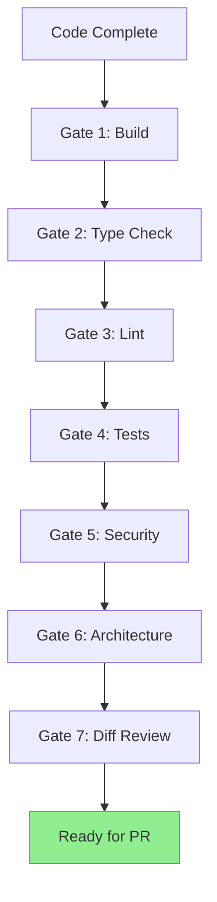

{reasoning effort: high}

# Verification Loop - Pre-PR Quality Gates Skill

## Purpose
Defines the mandatory verification loop that MUST pass before any PR is considered ready. 7 gates: build, type check, lint, tests, security, architecture, diff review.

## When to Invoke
- Before creating PR (used by `pr-engineer`, `towards`, `turing`, `tranquilao`, `qualy`)
- CI pipeline enforcement
- Pre-merge validation
- Release preparation

---

## The 7 Gates (All Must Pass)



### Gate 1: Build Passes
```bash
# Must produce deployable artifacts
bun run build
# or
npm run build
# or
go build ./...
# or
cargo build --release

# Success: Exit code 0, artifacts in dist/build/target
# Failure: Compilation errors, missing deps, config errors
```

### Gate 2: Type Check Passes (Zero Errors)
```bash
# TypeScript
bun run typecheck
# or
tsc --noEmit
# or
npx tsc --noEmit

# Python
mypy --strict .

# Go
go vet ./...

# Success: Zero errors (warnings OK if documented)
# Failure: Any type error
```

### Gate 3: Lint Clean (Zero Warnings)
```bash
# Biome (recommended)
bun run lint
# or
biome check --apply .

# ESLint
npm run lint
# or
eslint . --max-warnings=0

# Python
ruff check .

# Go
golangci-lint run

# Success: Zero warnings (or only allowed with inline config)
# Failure: Any warning/error
```

### Gate 4: Tests Pass with Coverage
```bash
# Unit + Integration
bun test
# or
npm test
# or
pytest -xvs
# or
go test ./...

# Coverage thresholds (ENFORCED)
# Lines: ≥ 80%
# Branches: ≥ 70%
# Functions: ≥ 80%
# Mutation (core): ≥ 60%

# Success: All tests pass + coverage thresholds met
# Failure: Any test failure OR coverage below threshold
```

### Gate 5: Security Scan Clean
```bash
# Secrets
trufflehog git file://. --since-commit HEAD~1 --fail
# or
gitleaks detect --source . --fail

# SAST
semgrep scan --config=.semgrep.yml --fail=on-error

# Dependencies
npm audit --audit-level=high
# or
pip-audit
# or
go vet ./... && govulncheck ./...

# Container (if Dockerfile)
trivy fs --severity HIGH,CRITICAL .

# Success: Zero Critical/High findings, zero secrets
# Failure: Any Critical/High vuln, any secret leak
```

### Gate 6: Architecture Check
```bash
# Circular dependencies
madge --circular --extensions ts,js src/
# or
dependency-cruiser src/ --rule-set .dependency-cruiser.json

# Dead code
ts-prune
# or
knip

# Boundary violations
# - Domain importing transport
# - Direct DB access in controllers
# - Missing tenant scoping

# Bundle size (frontend)
webpack-bundle-analyzer
# or
vite-bundle-analyzer

# Success: Zero circular deps, zero dead exports, boundaries respected, bundle within budget
# Failure: Any violation
```

### Gate 7: Diff Review (Intentional Changes Only)
```bash
# Review the actual diff
git diff origin/dev --stat
git diff origin/dev

# Checklist:
# □ No accidental formatting changes
# □ No console.log / print / debugger left
# □ No TODO / FIXME / HACK without issue link
# □ No commented-out code blocks
# □ No unrelated refactoring
# □ No test deletions (unless behavior changed)
# □ Config changes intentional
# □ Migration scripts included
# □ CHANGELOG updated for user-facing changes

# Success: Diff matches intent exactly
# Failure: Any unintentional change
```

---

## CI Pipeline Integration

```yaml
# .github/workflows/verification-loop.yml
name: Verification Loop
on: [pull_request]

jobs:
  verify:
    name: Verification Loop (7 Gates)
    runs-on: ubuntu-latest
    timeout-minutes: 30
    steps:
      - uses: actions/checkout@v4
        with:
          fetch-depth: 0  # Needed for diff review
      
      - name: Setup
        uses: actions/setup-node@v4
        with:
          node-version: '20'
          cache: 'npm'
      
      - name: Install
        run: npm ci
      
      # Gate 1: Build
      - name: Gate 1 - Build
        run: npm run build
      
      # Gate 2: Type Check
      - name: Gate 2 - Type Check
        run: npm run typecheck
      
      # Gate 3: Lint
      - name: Gate 3 - Lint
        run: npm run lint
      
      # Gate 4: Tests + Coverage
      - name: Gate 4 - Tests
        run: npm test -- --coverage
      
      - name: Check Coverage Thresholds
        run: |
          COV=$(cat coverage/coverage-summary.json | jq -r '.total.lines.pct')
          if (( $(echo "$COV < 80" | bc -l) )); then
            echo "Line coverage $COV% below 80%"
            exit 1
          fi
          COV=$(cat coverage/coverage-summary.json | jq -r '.total.branches.pct')
          if (( $(echo "$COV < 70" | bc -l) )); then
            echo "Branch coverage $COV% below 70%"
            exit 1
          fi
      
      # Gate 5: Security
      - name: Gate 5 - Secrets Scan
        uses: trufflesecurity/trufflehog-action@v1
        with:
          fail: true
      
      - name: Gate 5 - SAST (Semgrep)
        uses: returntocorp/semgrep-action@v1
        with:
          config: .semgrep.yml
          failOnError: true
      
      - name: Gate 5 - Dependency Audit
        run: npm audit --audit-level=high
      
      # Gate 6: Architecture
      - name: Gate 6 - Circular Deps
        run: npx madge --circular --extensions ts,js src/
      
      - name: Gate 6 - Dead Code
        run: npx ts-prune --error
      
      - name: Gate 6 - Boundary Check
        run: |
          # Check for domain importing transport
          if grep -r "from.*controller" src/domain/; then
            echo "Domain importing controller - VIOLATION"
            exit 1
          fi
          # Check tenant scoping
          if grep -r "where.*tenant_id" src/ --include="*.ts" | grep -v "tenant_id ="; then
            echo "Potential missing tenant scoping"
            exit 1
          fi
      
      # Gate 7: Diff Review (Automated Checks)
      - name: Gate 7 - No Console/Debug
        run: |
          if git diff origin/dev --name-only | xargs grep -l "console\.log\|debugger\|print(" 2>/dev/null; then
            echo "Console/debug statements found in diff"
            exit 1
          fi
      
      - name: Gate 7 - No TODO Without Issue
        run: |
          if git diff origin/dev | grep -E "^\+.*TODO|^\+.*FIXME|^\+.*HACK" | grep -v "#[0-9]\+"; then
            echo "TODO/FIXME/HACK without issue reference"
            exit 1
          fi
      
      - name: Gate 7 - CHANGELOG Check
        run: |
          if git diff origin/dev --name-only | grep -qE "src/|api/" && ! git diff origin/dev --name-only | grep -q "CHANGELOG"; then
            echo "Code changes but no CHANGELOG update"
            exit 1
          fi
      
      - name: All Gates Passed
        run: echo "✅ All 7 verification gates passed!"
```

---

## Local Verification Script

```bash
#!/bin/bash
# scripts/verify.sh - Run locally before pushing

set -euo pipefail

echo "🔍 Running Verification Loop (7 Gates)..."

# Gate 1: Build
echo "📦 Gate 1: Build..."
npm run build || exit 1

# Gate 2: Type Check
echo "🔍 Gate 2: Type Check..."
npm run typecheck || exit 1

# Gate 3: Lint
echo "✨ Gate 3: Lint..."
npm run lint || exit 1

# Gate 4: Tests
echo "🧪 Gate 4: Tests..."
npm test -- --coverage || exit 1

# Gate 5: Security
echo "🔒 Gate 5: Security..."
npx trufflehog git file://. --since-commit HEAD~1 --fail || exit 1
npx semgrep scan --config=.semgrep.yml --fail=on-error || exit 1
npm audit --audit-level=high || exit 1

# Gate 6: Architecture
echo "🏗️ Gate 6: Architecture..."
npx madge --circular --extensions ts,js src/ || exit 1
npx ts-prune --error || exit 1

# Gate 7: Diff Review
echo "📝 Gate 7: Diff Review..."
BASE="origin/dev"
if git diff $BASE --name-only | xargs grep -l "console\.log\|debugger" 2>/dev/null; then
  echo "❌ Console/debug in diff"
  exit 1
fi
if git diff $BASE | grep -E "^\+.*TODO|^\+.*FIXME|^\+.*HACK" | grep -v "#[0-9]\+"; then
  echo "❌ TODO/FIXME/HACK without issue"
  exit 1
fi

echo "✅ All 7 gates passed! Ready for PR."
```

---

## Verification Loop in PR Engineer Workflow

```typescript
// Integrated into pr-engineer's Phase 3
class VerificationLoop {
  async run(prNumber: number): Promise<VerificationResult> {
    const gates = [
      { name: 'Build', command: 'npm run build' },
      { name: 'Type Check', command: 'npm run typecheck' },
      { name: 'Lint', command: 'npm run lint' },
      { name: 'Tests', command: 'npm test -- --coverage' },
      { name: 'Security', command: 'npm run security:scan' },
      { name: 'Architecture', command: 'npm run arch:check' },
      { name: 'Diff Review', command: 'npm run diff:review' },
    ];
    
    for (const gate of gates) {
      const result = await this.executeGate(gate);
      if (!result.passed) {
        return { passed: false, failedGate: gate.name, output: result.output };
      }
    }
    
    return { passed: true };
  }
  
  private async executeGate(gate: Gate): Promise<GateResult> {
    // Run in worktree context
    // Stream output
    // Return pass/fail with details
  }
}
```

---

## Cubic Integration (Gate 8 - External)

```markdown
## Gate 8: Cubic Review (External AI Review)

- **Trigger**: Automatic on PR creation/update
- **Pass Criteria**: "No issues found" comment from `cubic-dev-ai[bot]`
- **Fail**: Issues found → fix in worktree → re-push → re-QA → loop
- **Skip**: ONLY when quota exhausted (explicit message from bot)
- **Never Skip**: Because "I think it's fine" or "issues are minor"

### Cubic Issue Response
1. Read Cubic's comment carefully
2. Reproduce locally if needed
3. Fix in worktree
4. Re-run MANUAL QA (new evidence file)
5. Commit + push
6. Loop continues
```

---

## Metrics & Targets

| Gate | Target | Measurement |
|------|--------|-------------|
| **Build** | < 2 min | CI duration |
| **Type Check** | < 30 sec | CI duration |
| **Lint** | < 30 sec | CI duration |
| **Tests** | < 5 min | CI duration |
| **Coverage** | Line ≥ 80%, Branch ≥ 70% | Coverage report |
| **Mutation** | Core ≥ 60% | Stryker report |
| **Security** | 0 Critical/High | Scan reports |
| **Architecture** | 0 violations | Tool output |
| **Diff Review** | 0 unintentional changes | Manual + automated |
| **First-Pass Rate** | > 80% PRs pass all gates | CI analytics |
| **Total Loop Time** | < 15 min | CI duration |

---

## Output Format (for agent using this skill)
```
## Verification Loop Result
- Gate 1 Build: [PASS/FAIL] - [duration]
- Gate 2 Type Check: [PASS/FAIL] - [errors]
- Gate 3 Lint: [PASS/FAIL] - [warnings]
- Gate 4 Tests: [PASS/FAIL] - [passed/failed, coverage: L%/B%]
- Gate 5 Security: [PASS/FAIL] - [findings]
- Gate 6 Architecture: [PASS/FAIL] - [violations]
- Gate 7 Diff Review: [PASS/FAIL] - [issues]
- Gate 8 Cubic: [PASS/FAIL/SKIPPED] - [issues]
- Overall: [READY FOR PR / FIX REQUIRED]
- Evidence: [QA evidence file path]
```